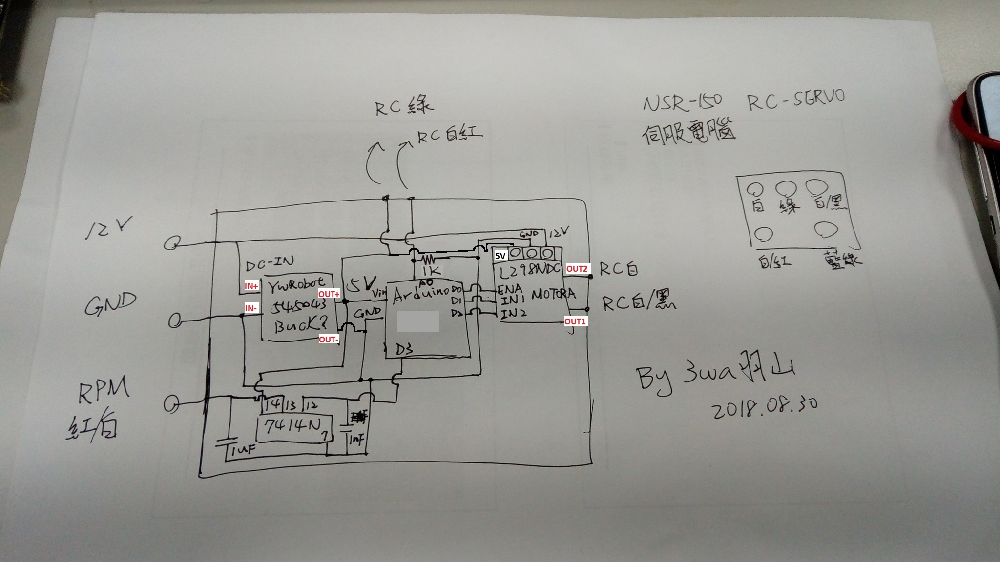

功能：NSR150 RC 電腦 
 
作者：羽山秋人 (http://3wa.tw) 
 
最初開發日期：2018-08-29 12:05 
最後更新日期：2018-09-04 01:23 
版本：V0.1 
 
說明： 
　　利用 Arduino ESP8266 + DC 壓降控制器 Buck + 馬達控制器 L298N + TTL IC 74LS14 製作的 NSR150 RC 電腦。
從NSR150維修手冊，可以得知 RC 馬達的測量方法，從 「白/白黑」線餵入「正向、反向」的12V電壓，可讓馬達旋轉。
然後 RC 伺服馬達可以量測「綠線、紅白」來取得目前RC伺服馬達的電阻，將馬達轉至 Lo ，測量約 1000Ω，轉至 Hi，
可以量到約 4000Ω。 
 
利用此特性，與 Arduino 腳位 A0 可以拿來作 Ohm Meter (電阻測量器)。 
然後使用 D0，D1，D2 來當作馬達驅動器腳位，連接 L298N： 
  D0 -> enA 
  D1 -> In1 
  D2 -> In2 
 
L298N 輸出的 Out1 -> RC 馬達的「白/黑」 
L298N 輸出的 Out2 -> RC 馬達的「白」 
 
RC 需要 12V 的電壓，將機車的 12V 餵入 L298N 後使用即可。 
Arduino 所需要的 5V 電源，將機車 12V 電源輸入，從 DC 壓降供應BUCK 穩定取得 5V 電源。 
 
D3 接腳用來抓取引擎訊號，引擎訊號透過 74LS14 過濾雜訊。 
 
電路圖： 
   
 
參考影片： 
  <a target="_blank" href="https://raw.githubusercontent.com/shadowjohn/NSR150_RC_Computer/master/Video/20180904_001626.mp4">播放影片</a>
 
詳細心得資料： 
  NSR-RC伺服馬達研究-第一章：http://3wa.tw/blog/blog.php?id=1457 
  NSR-RC伺服馬達研究-第二章：http://3wa.tw/blog/blog.php?id=1687 
  NSR-RC伺服馬達研究-第三章：http://3wa.tw/blog/blog.php?id=1688 
 
參考資料： 
  一、Arduino ohm meter: http://www.circuitbasics.com/arduino-ohm-meter/ 
  二、L298N 使用方法: https://howtomechatronics.com/tutorials/arduino/arduino-dc-motor-control-tutorial-l298n-pwm-h-bridge/ 
  三、抓取引擎訊號的二種解法: https://kokoraskostas.blogspot.com/2013/12/arduino-inductive-spark-plug-sensor.html 
  四、74LS14 參考資料: http://www.onsemi.com/pub/Collateral/SN74LS14-D.PDF
